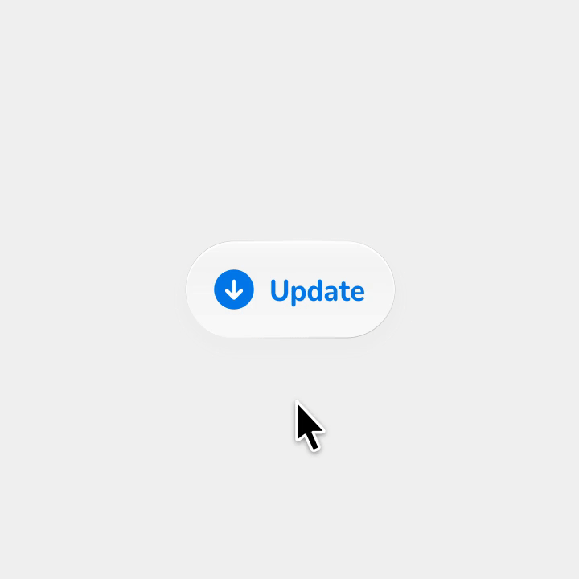
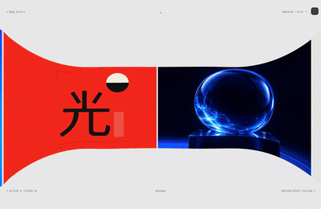

# 参考动画

基于公开演示独立复现的 UI 动效与交互研究。原作者与参考链接见各示例说明；字体等第三方组件保留各自许可。详见[来源、署名与权利说明](ATTRIBUTION.md)。

<table>
  <tr>
    <td align="center" width="33%"> <a href="examples/inspora-footer/README.md">Inspora footer</a></td>
    <td align="center" width="33%"> <a href="examples/praveen-cards/README.md">Praveen cards</a></td>
    <td align="center" width="33%"> <a href="examples/chatgpt-pip/README.md">PiP</a></td>
  </tr>
  <tr>
    <td align="center" width="33%"> <a href="examples/sketcha-onboarding/README.md">Sketcha onboarding</a></td>
    <td align="center" width="33%"> <a href="examples/shiba-online/README.md">Shiba online</a></td>
    <td align="center" width="33%"> <a href="examples/flo-composer/README.md">Flo composer</a></td>
  </tr>
  <tr>
    <td align="center" width="33%"> <a href="examples/tiny-animated-svg/README.md">Tiny animated SVG</a></td>
    <td align="center" width="33%"> <a href="examples/spencer-playful-hovers/README.md">Playful project hovers</a></td>
    <td align="center" width="33%"> <a href="examples/progress-squeeze/README.md">Progress squeeze</a></td>
  </tr>
  <tr>
    <td align="center" width="33%"> <a href="examples/luminous-tabs/README.md">Luminous tabs</a></td>
    <td align="center" width="33%"> <a href="examples/flight-pill/README.md">Flight pill</a></td>
    <td align="center" width="33%"> <a href="examples/document-signature/README.md">Document signature</a></td>
  </tr>
  <tr>
    <td align="center" width="33%"> <a href="examples/paperclip-interaction/README.md">Paperclip transcript</a></td>
    <td align="center" width="33%"> <a href="examples/file-upload-card/README.md">File upload card</a></td>
    <td align="center" width="33%"> <a href="examples/meeting-finder/README.md">Meeting Finder</a></td>
  </tr>
  <tr>
    <td align="center" width="33%"> <a href="examples/invite-code-reveal/README.md">Invite code reveal</a></td>
    <td align="center" width="33%"> <a href="examples/angry-sliders/README.md">Angry sliders</a></td>
    <td align="center" width="33%"> <a href="examples/expandable-tool-grid/README.md">Expandable tool grid</a></td>
  </tr>
  <tr>
    <td align="center" width="33%"> <a href="examples/tactile-controller/README.md">Tactile controller</a></td>
    <td align="center" width="33%"> <a href="examples/thanos-snap-ticket/README.md">Ticket dissolve</a></td>
    <td align="center" width="33%"> <a href="examples/sticky-note-app/README.md">Sticky note app</a></td>
  </tr>
  <tr>
    <td align="center" width="33%"> <a href="examples/dynamic-island-streak/README.md">Dynamic island streak</a></td>
    <td align="center" width="33%"> <a href="examples/adaptive-email-sidebar/README.md">Adaptive email sidebar</a></td>
    <td align="center" width="33%"> <a href="examples/rag-pipeline/README.md">RAG Pipeline</a></td>
  </tr>
  <tr>
    <td align="center" width="33%"> <a href="examples/morphing-braille-loader/README.md">Morphing braille loader</a></td>
    <td align="center" width="33%"> <a href="examples/card-details-sheet/README.md">Card details sheet</a></td>
    <td align="center" width="33%"> <a href="examples/task-card-gesture-stack/README.md">Task card gesture stack</a></td>
  </tr>
  <tr>
    <td align="center" width="33%"> <a href="examples/customizable-glass-folder/README.md">Customizable glass folder</a></td>
    <td align="center" width="33%"> <a href="examples/order-status-card/README.md">Segmented order-status card</a></td>
    <td align="center" width="33%"> <a href="examples/paid-stamp/README.md">Paid stamp</a></td>
  </tr>
  <tr>
    <td align="center" width="33%"> <a href="examples/adaptive-precision/README.md">Adaptive Precision</a></td>
    <td align="center" width="33%"> <a href="examples/minimap/README.md">Minimap</a></td>
    <td align="center" width="33%"> <a href="examples/agent-plan/README.md">Agent plan</a></td>
  </tr>
  <tr>
    <td align="center" width="33%"> <a href="examples/tap-get-invoice/README.md">Tap / get invoice</a></td>
    <td align="center" width="33%"> <a href="examples/light-work/README.md">Light Work</a></td>
    <td align="center" width="33%"> <a href="examples/life-in-weeks/README.md">Life in Weeks</a></td>
  </tr>
  <tr>
    <td align="center" width="33%"> <a href="examples/macos-genie/README.md">macOS Genie</a></td>
    <td align="center" width="33%"> <a href="examples/chatgpt-dot-send/README.md">dot send</a></td>
    <td align="center" width="33%"> <a href="examples/nested-tag-creation/README.md">Nested tag creation</a></td>
  </tr>
  <tr>
    <td align="center" width="33%"> <a href="examples/micro-progress-button/README.md">Micro progress button</a></td>
    <td align="center" width="33%"> <a href="examples/chatgpt-space-welcome/README.md">ChatGPT Space</a></td>
    <td align="center" width="33%"> <a href="examples/marcelo-portfolio-ribbon/README.md">Portfolio ribbon</a></td>
  </tr>
</table>

