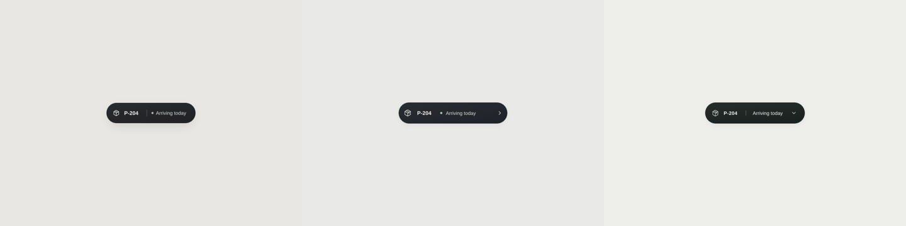
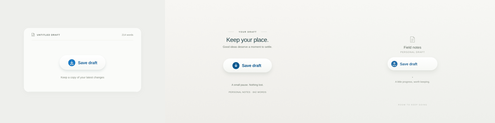

# First animation comparison

Six independent SVG studies compared reference-only prompting, the current Motionbook skill, and a candidate adding two sentences encouraging useful comparison with the source preview. Both briefs supplied the same references and tools across conditions.

The result was split: for the progress control, current scored 18/20 and candidate 17/20; for the parcel-detail transition, current scored 17/20 and candidate 18/20. The reference-only studies scored 17/20 on both. The candidate was not adopted. Several studies added small decorative copy; a separate held-out check investigates that behavior.

See results.json for the five-axis scores, observations, and source hashes; submissions/ contains the actual authored SVG generators and supporting code/tests. Captures were produced from these generators, not separate mockups. Review used sampled frames; browser behavior and perceived real-time smoothness were not established.

This is exploratory evidence from one generation per condition/brief, not a general benchmark or statistical claim.

## Actual output previews

Each row is left-to-right: current skill, candidate skill, no skill. The images add no labels or decorative overlays.

### Parcel detail: A / C / E

### Save draft: B / D / F

Individual GIFs: [A](previews/A.gif), [B](previews/B.gif), [C](previews/C.gif), [D](previews/D.gif), [E](previews/E.gif), [F](previews/F.gif).

[Replay commands and limits](../README.md) · [Conditions](CONDITIONS.md)
