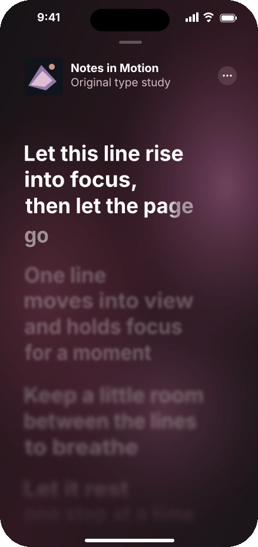

# Apple Music Lyrics · 逐帧动效研究

[Demo](index.html) · [Video](preview/loop.mp4) · [¼-speed review](preview/highlight-review/highlight-review-0.25x.gif) · [Validation](VALIDATION.md) · [Fidelity](FIDELITY.md) · [Provenance](PROVENANCE.md)

从 Apple 2023 年官方 Sing 教程的真实动态画面量测歌词滚动、组间错峰、空间渐变扫亮与前后景柔化，再用原创文字重建。不是 Apple 源码，也不是原生应用录屏。

## 运行

直接打开 `index.html`，或运行 `npm start`，在本机访问 `http://127.0.0.1:4174`。运行时没有外部依赖、账户、音乐服务或音频。离线渲染需要 Node 20+、`npm install` 安装 Sharp，以及系统 ffmpeg/ffprobe。

- `npm test`：纯函数、状态机、模拟 DOM、确定性 SVG 和媒体绑定检查
- `npm run render -- --source /absolute/path/to/the/official-video.mp4`：依据原始 PTS 导出；原视频不随包提供
- `node tools/measure-authored-text.cjs`：改动原创文本后重新量测 bundled Inter 的实际字形边界
- `node tools/calibrate.cjs`：用保留的数值量测重建最终校准数据
- `node tools/calibrate.cjs --even-only`：历史隔帧拟合实验；会覆盖校准文件，需要再运行默认命令恢复最终数据

预览是 `preview/loop.gif` 与 `preview/loop.mp4`。它们由浏览器也在使用的 `src/motion.js` 和 `src/scene.js` 离线栅格化，不是录屏。相同时间输入对应相同图层状态。

## 操作

播放/暂停、原速重播、反向回放、时间轴 seek；拖动或滚轮进入手动查看，“Follow lyrics”或 Escape 返回跟随；左右方向键逐步 seek。页面隐藏后冻结时钟，回来续接。系统减少动态效果开启时停止自动播放、移除模糊，可查看静态时刻。

手动查看、打断、恢复跟随、反向和减少动态效果是本项目补充的交互模型，官方片段没有验证这些原生分支。反向按钮反放同一路径，并不冒充 Apple 原生后退行为。

## 可核查文件

- [来源与权利边界](PROVENANCE.md)
- [还原范围与差异](FIDELITY.md)
- [验证结果](VALIDATION.md)
- [中文交付说明](SUMMARY.zh-CN.md)
- `validation/observations.json`：完整几何观测与原始历史隔帧分组
- `validation/final-observations.json`：最终全点拟合用途；不保留独立几何验证集
- `validation/highlight-observations.json`：静止区间近白像素扫亮前沿
- `validation/relative-softness-fit.json`：相对 Gaussian + contrast 图像拟合
- `validation/historical-even-calibration-data.js`：被否决的早期隔帧模型，便于审计端点误差

发布范围仅包括本例、对应 catalog 条目与根目录预览索引；其他例子保持不变。

## 扫亮修订

`validation/highlight-QA.md` 记录逐帧诊断与新测试。`tools/render-highlight-review.cjs` 可生成标明 0.25× 的旧/新特写；默认读取随包保存的旧共享场景与匿名数值亮度场，不需要分发原视频。
