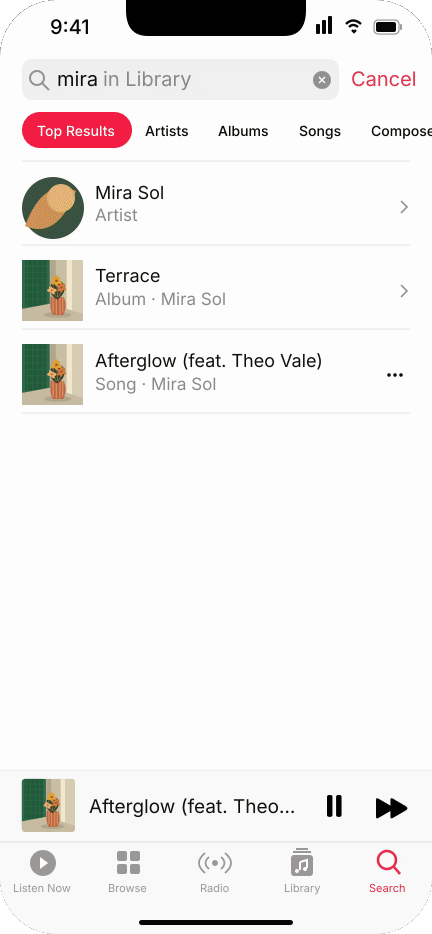

# Apple Music Player



[Open demo](index.html) · [Normal-speed video](preview/loop.mp4) · [Reference & rights](PROVENANCE.md) · [Fidelity](FIDELITY.md) · [Validation](VALIDATION.md)

An independent, video-first reconstruction of the classic iPhone Music player shown in Apple's WWDC22 demonstration. Original cover artwork and fictional music metadata are used throughout.

## What is reconstructed

- The recorded compact-player press, expansion, full-size downward drag, and final collapse
- A single shared cover, independently sampled sheet geometry, background retreat, layered controls, and a separate tab-bar clock
- The observed cover rebound at the compact end. The close is not a reversed opening
- Source-time scrubbing and a deterministic replay at 1× timing

The demo also offers a supplemental interactive model: drag, tap, keyboard, interruption, reversal, cancellation, and reduced motion. Its release thresholds and spring are not recovered Apple implementation parameters. The selected clip does not demonstrate a canceled drag back to expanded.

## Run

Open `index.html` directly in a modern browser. No network, account, service API, or installation is needed for the demo. Alternatively, run `npm start` and open the address shown locally.

```sh
npm install
TEST_MEDIA_ENCODER=1 npm test
npm run render
```

Node 20+, Sharp 0.35.4, and an FFmpeg/FFprobe installation are needed only for tests and reproducible media export. Python, Pillow and NumPy are optional, only for regenerating the procedural background from its color-token grid.

## Shared implementation

`src/calibration-data.js` contains observed source-time geometry and separate appearance knots. `src/motion.js` provides deterministic reference sampling plus the supplemental controller. `src/scene.js` defines the actual SVG scene; browser updates patch persistent SVG nodes. The offline renderer rasterizes that same SVG with Sharp/librsvg. The exported GIF is not a browser screen recording.

`tools/render.cjs` produces source-paced GIF/MP4 and hash bindings. `tools/build-comparison.cjs` optionally creates a critical comparison when supplied an authorized local source video; it refuses to save source-video comparisons inside the repository. Neither the source video nor its frames are shipped in this example.

See the [Chinese delivery summary](SUMMARY.zh-CN.md) for scope and remaining differences.
