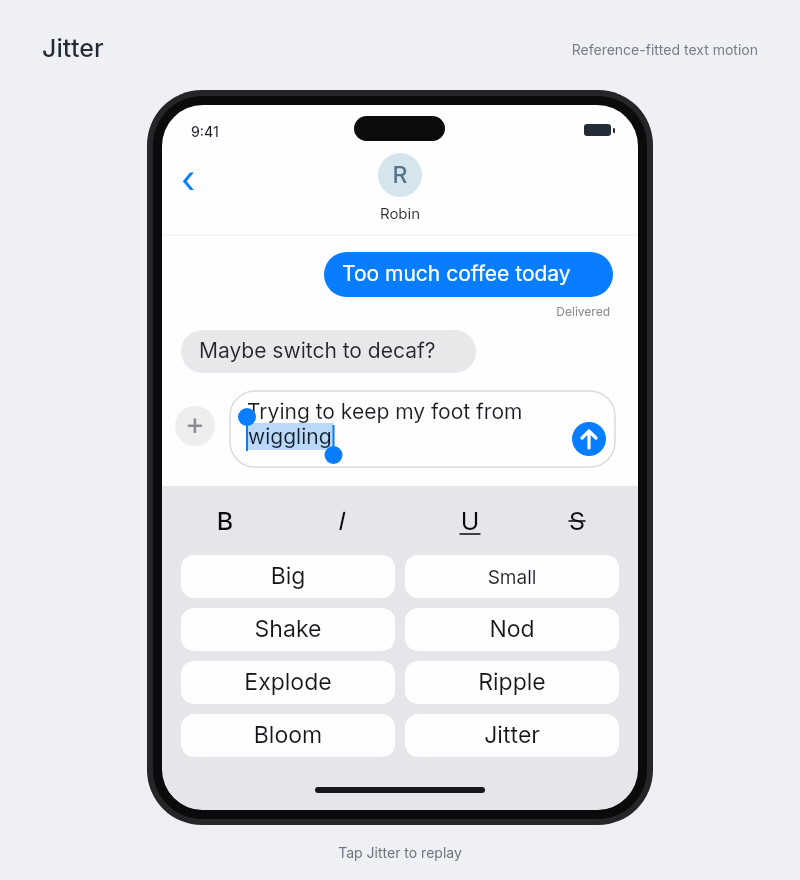

# iMessage Jitter

[](preview/jitter.mp4)

[Demo](index.html) · [Reference](https://developer.apple.com/videos/play/wwdc2024/101/?time=1317) · [中文实现说明](实现说明.md) · [Evidence](EVIDENCE.md)

An independent, reference-fitted recreation of the Jitter text effect selected in Apple's WWDC24 Keynote at about 21:57. Original chat content, redrawn interface, and OFL-licensed Inter font.

The inspected word moves predominantly as coordinated translation and rocking. The earlier candidate description of unrelated per-character phases was too strong. Glyphs are laid out and rendered individually, but their transforms preserve the coordinated motion measured in the clip. No generic random shake is substituted.

## Open and edit

Open `index.html` directly in a browser. The demo has no framework, remote resources, server dependency, or build step. Use the word field, Replay, Pause/Resume, and Reduce motion. The seven other menu cells provide visual context and are not effect implementations.

- `src/motion.js`: deterministic timing, grapheme layout, replay/pause/cancel controller
- `src/tracks.js`: compact 29.97 fps source-fitted transform samples
- `src/scene.js`: shared Canvas scene used by both HTML and offline export
- `src/app.js`: browser controls, reduced-motion preference, visibility interruption handling
- `tools/render.cjs`: normal-speed preview generation
- `tools/measure_reference.py`, `tools/fit_global.py`, `tools/build_tracks.py`: fit audit and sample generation
- `test/motion.test.cjs`: focused state, layout, Unicode and pixel tests

## Tests and export

Node 20+ and `@napi-rs/canvas` 0.1.100 are needed for the optional tests/render path. FFmpeg is needed for media export. Browser playback does not need these packages.

```sh
npm install
npm test
npm run render
```

`npm install` is an instruction for a consuming developer; no software was installed for this delivery. Tests used the already available runtime.

The GIF is an offline render of the shared runtime, not a browser recording or an iOS recording. Browser interaction QA and native-device QA were not run. See `preview/tests.tap`, `preview/render-manifest.json`, and `preview/media-validation.json` for the checks actually completed.

## Integration

This public example lives at `examples/imessage-jitter/`. The repository gallery and retrieval catalog link to its normal preview. Official video, extracted source frames and pixel-comparison media are not included.

## Credits

Reference: Apple, WWDC24 Keynote (2024), Messages text effects, approximately 21:57–22:00. Apple and iMessage are trademarks of Apple. This is an independent study, not an Apple component. Official reference excerpts are not redistributed in this public bundle. Inter: The Inter Project Authors, SIL Open Font License 1.1; license included in `assets/Inter-LICENSE.txt`.

Reference-fit scripts expect locally supplied decoded reference frames under `evidence/frames/f-001.png` onward. Those raw Apple frames and the original source video are deliberately not included in the reusable source package. Compact measured JSON is retained as numerical provenance; official source pixels and comparison exports are excluded.

## Interaction revision 1.0.1

The transport now shows Replay after completion, Resume only for a genuine paused interval, and Pause while playing. Preference and page-lifecycle changes synchronize the controls. There are now 18 automated checks, including seven direct app-adapter regressions. Shared scene/timing inputs and GIF/MP4 bytes are unchanged; see VALIDATION.md.
