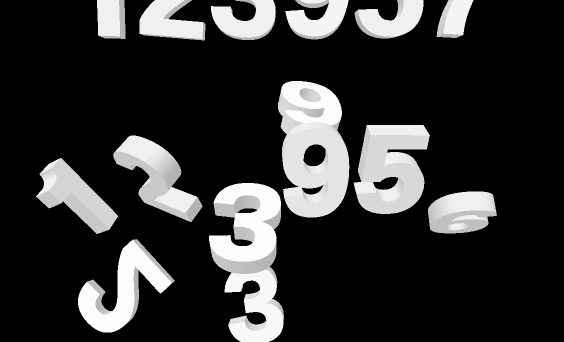

# 翻落数字时钟

每秒产生一排六位时间数字。数字从画面上方进入、碰撞在狭窄的隐形平台上，再向前后和两侧翻落。

[演示页面源码](index.html) · [来源与权利说明](PROVENANCE.md) · [验证结果](VALIDATION.md)

## 设计机制

这个效果把时间变成持续更新的立体物体。辨识点是完整六位数字的节拍、即时下落、真实侧壁与孔洞，以及细窄承托区造成的随机翻倒。适用于实验性时钟、字体演示和具有强烈动态表现的独立场景。

当清晰稳定读时、低性能设备或持续无障碍阅读是主要约束时，应选择更安静的表现。这里不把动态复杂度宣传为可用性提升。

## 运行与编辑

浏览器直接打开 index.html 即可，无需网络库。也可以在此目录执行 python3 -m http.server 8080 后，通过本地 HTTP 查看。初始时间、随机种子、重力、速度均可编辑，支持暂停、重播、拖动进度和静态模式。

- geometry-data.js / build-geometry-v2.py：OFL 字体衍生的封闭三角网格，真实孔洞和挤出内外壁，数字 1 为独立无底脚轮廓
- renderer.js：透视投影、逐像素深度缓冲、白色材质和抗锯齿；Node 导出与浏览器实时使用同一份代码
- motion.js：固定时间步的确定性刚体状态、碰撞、四元数插值、有限生命周期和可重复随机数
- scene-config.js：按录屏构图和节拍选定的可调参数
- playback.js / app.js：播放状态、隐藏页面冻结、静态模式、重复交互和恢复
- render.cjs：离线导出入口，调用相同模型和渲染函数

测试前在本目录运行 npm install，然后运行 npm test。离线导出使用 package.json 指定版本的 @napi-rs/canvas；浏览器演示本身不需要该依赖。Python 字形重建需要 fontTools 和 NumPy，现成 geometry-data.js 已包含在包内。Python 辅助依赖见 requirements.txt。

重建正常速度 GIF：运行 npm run render 生成 preview/frames，再运行 python3 encode-preview.py preview/frames --output preview.gif。该脚本读取导出清单中的5.10秒时长，按GIF的百分之一秒精度分配帧延迟，不改变动画速度。

## 输入与时间

界面起始时刻必须是 00:00:00–23:59:59；随机种子是非空 uint32 整数；重力滑块范围 800–1800；速度 0.25–2 倍；时间轴 0–33.429333 秒。更完整的低层输入契约见 [motion-notes.md](motion-notes.md) 和 [renderer-notes.md](renderer-notes.md)。

预览 GIF 是正常速度 5.10 秒片段，128 个不同画面，覆盖跨分钟场景；循环回到片段开头是演示剪辑，不是时间连续闭环。

## 第二版调整

新版独立重做数字 1 的肩部，并将字面做通用 0.012-cap 加厚后归一化；侧面亮度从偏深灰改为参考中较浅的灰白。采用真实物理预设匹配展示片段，包括更窄的30单位支撑、较小回弹及可编辑初始倾斜。模型仍是实时物理计算，没有用录屏或逐帧姿态表回放。

本次动力学预设在14.784–19.770秒片段选择，相邻22–28秒用于未参与选择的检查。该预设改善展示片段，但在相邻片段不如仅修改字形/材质的版本，不能称一致的整片精确复刻。见 [V2-FIDELITY.md](V2-FIDELITY.md)。

## 参考精度

参考是 Kitasenju Design 的 [clock 原帖](https://x.com/kitasenjudesign/status/2107677781471658319)。分析依据是用户授权的可见画面录屏，共 303 张，约 8.66 fps，没有取得原始 MP4 或原生 PTS。

实现匹配每秒节拍、入场速度、数字尺度和碰撞带等主要机制。字体、随机初始状态、碰撞求解器和轨迹均为独立近似。没有宣称逐像素复制，也没有把作者旧项目直接作为原片源代码再分发。
