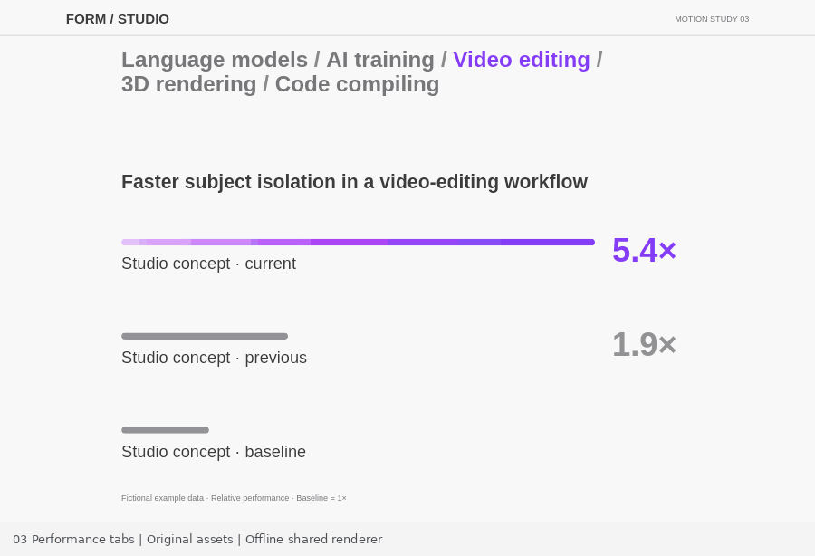

# 03 · Performance tabs

A standalone, original benchmark comparison study. Open `index.html` in a browser. There are no runtime packages, downloads, or external services. Canvas draws the visual; real HTML buttons, a labelled tabpanel, a live region, and a data table preserve semantics. The bundled Liberation Sans font is licensed in `assets/FONT-LICENSE.txt`.

## Source-to-recreation mapping

Reference: Apple Mac Studio performance gallery; inspected 2026-10-07. The source capture is 1188×761 CSS pixels (raster frames 1173×751), fixed at page y=5470. It begins on Video editing, selects LLM prompt processing on capture frame 8, then AI training on frame 50. Capture timing places these selections at 0.326 and 2.310 seconds over 4.064 seconds. `state(progress)` follows that sequence without guessing that evenly spaced GIF frames equal capture time.

At 1188px, the comparison column starts at 14.9% width, the heading is y=252, bar rows are y=348/485/622, masks are 10px high, and values occupy a fixed right-hand column. The source's top navigation and copy are replaced with an original study identity, five task names, and visibly labelled fictional data. All rows normalize to the first row, while the third row stays the 1× baseline. No commercial benchmark data is represented as a measurement.

The public source `cdaea440d284969e8550` shows 1.2-second easeOutCubic bar motion, with the top/middle/bottom rows beginning at 0.4/0.5/0.6 seconds. This implementation uses those timings. A full-width bar translates from −100% inside a fixed rounded clip; the chart itself stays still. Old chart copy fades out over 160ms; new copy fades in over 200ms after that. Those copy-fade timings are an approximation derived from the captured blank/content states, not a claimed exact source value.

## Deterministic API

- `window.MOTION.setProgress(p)` seeks the 4.064-second reference sequence, clamped to [0,1]
- `window.MOTION.seek(seconds)` seeks the same sequence in seconds
- `window.MOTION.setTab(index, transitionProgress = 1)` sets a task and explicit 0–1 transition progress
- `window.MOTION.getState()` reports selection, previous selection, row reveals, reduced motion, playback and destruction
- `window.MOTION.play()` replays the sequence once
- `window.MOTION.destroy()` cancels RAF and removes all listeners

`scene.js` is the same UMD Canvas renderer in browser and offline. `scene.cjs` registers the two bundled fonts, then exports it. Offline use: `const scene = require('./scene.cjs'); scene.render(ctx, width, height, progress, options)`. Optional overrides are `{tab, previousTab, transitionProgress}`. Source duration: `scene.duration`; click transition duration: `scene.transitionDuration`.

## Interaction and fallback

Real tab buttons support click, Arrow Left/Right/Up/Down, Home, and End; one tab is in the tab sequence. Every user action invalidates the prior RAF generation, so a stale completion cannot restore an old tab. System reduced motion settles immediately; changing that preference during playback stops it. Narrow screens wrap tabs and use a taller layout. No-JavaScript fallback describes the example.

## Verification

Run `node test.cjs` with `@napi-rs/canvas` available for offline QA. Tests cover all tabs, deterministic seeks, clamping, row stagger, rapid triple interruption including a deliberately invoked stale callback, Home/End navigation, reduced motion, responsive hitboxes, resize, destroy, and 18 render samples across 1188/720/390px. Offline visual review covered the generated render samples; the intermediate review images are not bundled. This is Canvas/state verification, not an assertion that a live browser or screen reader was exercised.

## Runtime interruption correction (v0.1.2)

Rapid selection changes now preserve the currently visible content in one temporary Canvas snapshot, then transition from that frame. The previous unfinished target is no longer substituted at full opacity. Selecting the active target is a no-op; cancelling, manual seeking, mode changes (where available), completion, and teardown release the snapshot. Normal deterministic reference replay is unchanged. If the viewport changes during this short interrupted transition, its frozen content scales to the new drawing area until the final responsive content takes over.

The [collection regression harness](../../integration-tests/mac-studio/test-runtime-regressions.cjs) checks pixel continuity at interruption, reversal, repeated selections, stale callbacks, final content and dynamic reduced motion at desktop/DPR1 and 390px/DPR2. The normal-reference frame hashes remain identical to v0.1.1. These are offline Canvas/DOM checks, not browser or screen-reader verification.

## Standalone Motionbook package

Version 0.1.2. This directory is independently runnable: open `index.html`, or run `npm start` and visit `http://localhost:8000`. Browser runtime requires no package installation. For offline tests, run `npm install` then `npm test` in this directory. Node.js and the pinned test-only Canvas package are required.

The normal-speed preview is an offline export of the shared live renderer, not a browser recording. Official reference captures and side-by-side comparison GIFs are deliberately excluded. See [provenance](PROVENANCE.md) and [validation boundaries](VALIDATION.md).
