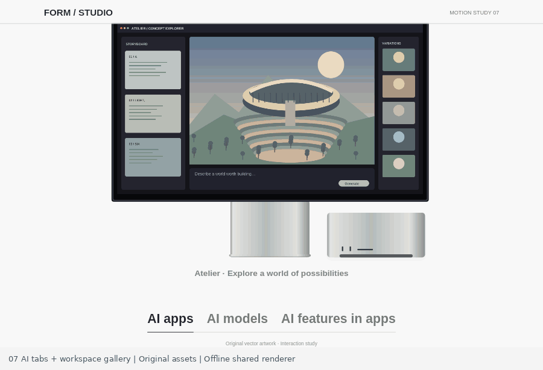

# 07 · AI tabs and workspace crossfades

Two independent gallery patterns in one standalone study. Open `index.html`, then switch between **AI tabs** and **Workspaces** below the scene. No runtime packages or network services are required. Six original SVG illustrations are supplied and reproducibly generated by `generate-assets.py`; no Apple artwork, screenshots, logos, product imagery, or application interfaces are embedded.

## Source-to-recreation mapping

Reference: Apple Mac Studio AI TabnavGallery and Studio Display SimpleGallery, inspected 2026-10-07. The AI capture stays at page y=10805. The 1188×761 CSS viewport produces 1173×751 raster frames. It begins on AI apps; frame 8 selects AI models, and frame 50 selects AI features. Actual capture timestamps place the changes at 0.325 and 1.854 seconds, over 3.433 seconds. The default deterministic sequence follows these capture timestamps rather than equating frame count with elapsed time.

At 1188px, the monitor occupies x=244, y=39, width=694, height=403. The top header occludes a small portion, as in the reference. The stand and small original computer remain stationary; the caption is y=589, tabs y=684. The incoming image overlays the prior opaque image. Only its opacity changes; images do not slide. Captions change with the same eased progress, and the current tab and underline remain synchronized.

Source modules `9cfdd4749d4bd7c3c7a4` and `5089575a99095900260b` explicitly configure a 0.5-second fade. `72f11763e1cfdcae50c1` specifies desktop easeInOutCubic (touch uses easeOutCubic). This study uses the desktop curve. Focus and selected state follow the user's target immediately; the original gallery's internal currentIndex changes after the fade midpoint, a deliberate semantic timing difference disclosed here.

Workspace mode uses a full-width image at x=24, y=52, width=1140, height=650, rounded clipping, circular previous/next controls, and three position dots. The source workspace evidence contains a verified Next end state; its 0.6/1.9-second automatic demo selections here are authored demonstration pacing, not measured source click times. The 0.5-second transition itself is source-confirmed.

## Assets

- `ai-creative.svg`: original concept-art workspace and floating observatory
- `ai-models.svg`: original local-model playground and network constellation
- `ai-features.svg`: original code editor and cartographic poster
- `workspace-quiet.svg`, `workspace-shared.svg`, `workspace-night.svg`: original architectural workspaces
- Liberation Sans fonts: redistributable license included at `assets/FONT-LICENSE.txt`

Regenerate the vector artwork with `python generate-assets.py`. Every drawing is deterministic; no random state, remote assets, or third-party art is needed. The licensed font is bundled to keep offline and browser text metrics consistent.

## Deterministic API

- `window.MOTION.setProgress(p)` seeks the 3.433-second sequence
- `window.MOTION.seek(seconds)` seeks in seconds
- `window.MOTION.setTab(index, transitionProgress = 1)` selects either an AI tab or workspace with explicit progress
- `window.MOTION.setMode('ai' | 'workspace')` switches gallery and settles on item 0
- `window.MOTION.next()` / `.previous()` animate with wraparound
- `window.MOTION.play()` replays the current mode's sequence once
- `window.MOTION.getState()` reports mode, target/previous index, alpha, caption, assets, playback, reduced motion, and destruction
- `window.MOTION.ready` resolves when local illustration and font loading finishes
- `window.MOTION.destroy()` cancels pending RAF and removes listeners

The renderer is shared exactly: `scene.js` is browser UMD; `scene.cjs` registers the bundled fonts and loads the SVGs with `@napi-rs/canvas`. For offline rendering, `const scene = require('./scene.cjs'); await scene.ready; scene.render(ctx, width, height, progress, options)`. Optional parameters: `{mode, tab, previousTab, transitionProgress}`. `scene.state(progress, options)` returns the same deterministic motion state without rendering. Loading `scene.js` directly requires registering the font and supplying decoded SVGs through `scene.setImages(images)`.

## Interaction, resilience, and verification

AI tabs and workspace dots are real HTML tab buttons with accessible names, a labelled tabpanel, roving tabindex, Arrow Left/Right/Up/Down, Home, and End. Workspaces also have normal labelled next/back buttons. A live region announces changed captions. Each new action invalidates prior RAF callbacks; rapid clicks cannot restore an old selection. System reduced motion immediately settles the current item. Resizing repaints the same state; small screens use a taller layout. Assets are local, and a no-JavaScript illustration/description is included.

`node test.cjs` runs offline tests with `@napi-rs/canvas`: six local asset loads; timestamp sequence; cubic fade; all tabs; next/back wraparound; position dots; keyboard; interrupted triple-click with a deliberately invoked stale callback; reduced motion; mobile hitbox bounds; resize; cleanup; and 36 renderer samples across 1188/720/390px and both modes. The generated render samples were visually inspected; intermediate review images are not bundled. These checks exercise the shared Canvas engine and a fake DOM event harness, not a live browser, mobile device, or screen reader.

## Runtime interruption correction (v0.1.2)

Rapid selection changes now preserve the currently visible content in one temporary Canvas snapshot, then transition from that frame. The previous unfinished target is no longer substituted at full opacity. Selecting the active target is a no-op; cancelling, manual seeking, mode changes (where available), completion, and teardown release the snapshot. Normal deterministic reference replay is unchanged. If the viewport changes during this short interrupted transition, its frozen content scales to the new drawing area until the final responsive content takes over.

The [collection regression harness](../../integration-tests/mac-studio/test-runtime-regressions.cjs) checks pixel continuity at interruption, reversal, repeated selections, stale callbacks, final content and dynamic reduced motion at desktop/DPR1 and 390px/DPR2. The normal-reference frame hashes remain identical to v0.1.1. These are offline Canvas/DOM checks, not browser or screen-reader verification.

## Standalone Motionbook package

Version 0.1.2. This directory is independently runnable: open `index.html`, or run `npm start` and visit `http://localhost:8000`. Browser runtime requires no package installation. For offline tests, run `npm install` then `npm test` in this directory. Node.js and the pinned test-only Canvas package are required.

The normal-speed preview is an offline export of the shared live renderer, not a browser recording. Official reference captures and side-by-side comparison GIFs are deliberately excluded. See [provenance](PROVENANCE.md) and [validation boundaries](VALIDATION.md).
