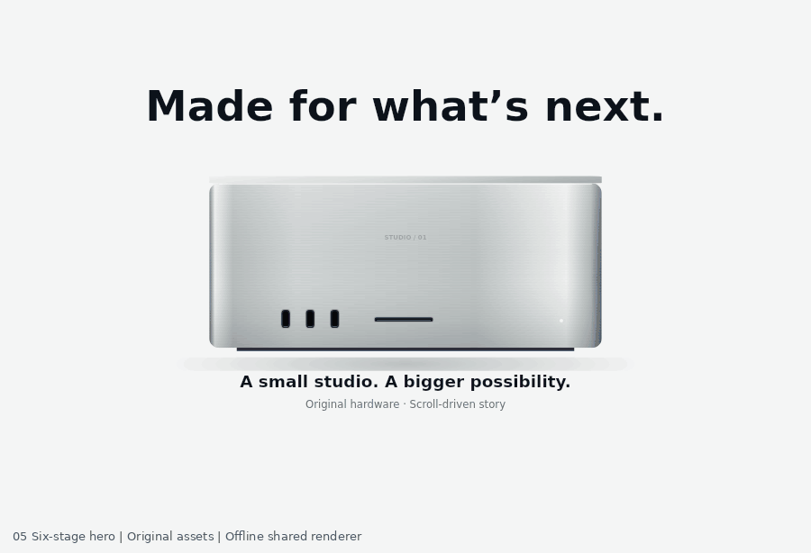

# 05 · Multi-scene hero

An original, dependency-free Canvas 2D motion study. Open `index.html` from the collection or as a standalone local file. The scripts load no images, videos, remote fonts, packages, or tracking resources.

## What is reproduced

Six reversible stages: front product → back product → camera push → full-color environment → black performance heading → two chips with staggered specifications. Browser scrolling, transport playback, range seeking, and offline capture share `scene.js`.

- Browser: `window.MOTION.setProgress(0.5)`, `getState()`, `destroy()`; also `play()` and `pause()`
- Node: `require('./scene.js').render(ctx, width, height, progress, options)` and `.state(progress)`
- `.duration === 7` means the optional demonstration playback lasts seven seconds. It is not the source website's intrinsic animation duration
- Reduced motion: a static, readable final frame, with the complete information in semantic HTML; autoplay is disabled, manual inspection remains available

## Source observations

Reference: https://www.apple.com/mac-studio/ and its public page-specific script at https://www.apple.com/v/mac-studio/o/built/scripts/main.built.js

The reference uses two JPEG image sequences (43 and 111 frames), followed by DOM chips and specs. It was visibly enhanced at a 1485×951 CSS viewport at normal browser 80% zoom. Its supplied reference GIF has a trimmed opening wait and explicit 3× capture playback; that timing is not a source animation constant.

This implementation substitutes deterministic original procedural artwork for every source image. Its `hardwareFrame` and `environmentFrame` are correspondence metadata, not claims that copied frames are loaded. It uses Canvas 2D throughout, with accessible HTML descriptions. Spec reveals use a 0.3-second-equivalent ease-out and 0.09-second-equivalent stagger on the seven-second demonstration timeline; mapping them into progress preserves deterministic reverse seeking. This is an intentional implementation difference from source CSS wall-clock transitions.

## Phase correspondence

Approximate raw capture frame → study progress, linearly interpolated between anchors:

`[[0,0],[4,.065],[10,.17],[20,.267],[25,.345],[31,.447],[35,.49],[43,.65],[47,.72],[52,.845],[56,.92],[62,1]]`

Matching is based on visible stages. Use `phase-map.json` for machine-readable anchors. Label synchronized comparisons **phase-matched**, not real-time browser recordings. Source sampled scroll anchors were front 0, back 951, push 1665, environment 2379, heading 2973, and chips 3568; those pixel coordinates are evidence, not hardcoded runtime scroll offsets.

## Verification

`node test.cjs` runs six tests. The included `qa.json` records a pass for all six: state bounds; deterministic reversibility; 390×844, 900×576 and 1440×900 rendering; phase and stagger endpoints; runtime controls in a DOM harness; reduced motion in the harness. Pixel contact sheets were inspected at desktop and phone proportions, and mobile text overflow was corrected.

Real-browser sticky layout, operating-system reduced-motion, and physical-device interactions were not run.

## Artwork provenance

All hardware geometry, machining marks, vent patterns, ports, glowing chips, and woven light curves are generated by the included source. No Apple assets, logos, photographs, fonts, or sequence frames are shipped. All product specifications are explicitly fictional demo copy. Font selection uses locally available DejaVu Sans with Arial/sans-serif fallbacks; no font files are redistributed.

## Runtime resize correction (v0.1.2)

Resizing now recalculates progress from the new track/viewport geometry while in scroll mode. Manual seek and playback retain their positions. The [collection regression harness](../../integration-tests/mac-studio/test-runtime-regressions.cjs) covers all three cases with changed viewport and track heights. Scene rendering, phase mapping, artwork and displayed preview frames are unchanged. This adds DOM-harness coverage; real-browser resize/sticky validation is still outstanding.

## Standalone Motionbook package

Version 0.1.2. This directory is independently runnable: open `index.html`, or run `npm start` and visit `http://localhost:8000`. Browser runtime requires no package installation. For offline tests, run `npm install` then `npm test` in this directory. Node.js and the pinned test-only Canvas package are required.

The normal-speed preview is an offline export of the shared live renderer, not a browser recording. Official reference captures and side-by-side comparison GIFs are deliberately excluded. See [provenance](PROVENANCE.md) and [validation boundaries](VALIDATION.md).
