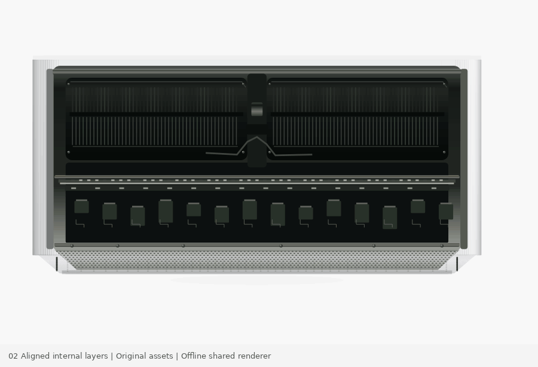

# 02 · Registered internal layers

Six perfectly aligned original hardware layers, followed by width/height measurements. Open `index.html` directly. No build step, dependencies, or network assets.

## Controls and public API

Scroll, range input, Play / Pause / Reset, and `window.MOTION.setProgress(p)`, `getState()`, `destroy()` provide deterministic seek, state inspection, and cleanup. The range selects 0–1 progress; Play/Pause controls the local timeline and Reset returns to its start. `window.MotionScene.render(ctx,width,height,p,options)` is the same pure Canvas renderer used by the live page and offline exports. In Node, `require('./scene.js')` automatically loads local `hardware.js`.

## Source mechanism

Reference: https://www.apple.com/mac-studio/ and its public `InternalsXRay` module in https://www.apple.com/v/mac-studio/o/built/scripts/main.built.js , with CSS in https://www.apple.com/v/mac-studio/o/built/styles/overview.built.css . Source and supplied GIF pixels inspected 2026-10-07.

The original uses six registered `<picture>` layers. It is NOT an exploded model: parts do not travel away from one another. This study preserves that essential distinction. Original procedural drawings replace all six image layers; the neutral machined enclosure, circuits, and dimensions are illustrative. No Apple imagery, logos, proprietary renders, or source code are bundled.

The five opacity transitions exactly follow the source's one default-duration layer plus four layers with `data-scroll-duration=.25`:

| Registered layer | Opacity 0→1 over progress |
|---|---:|
| Fans / structural base | Always present |
| Logic board / processing module | 0 → 1/6 |
| Connections / antenna | 1/6 → 3/8 |
| Perforated foot | 3/8 → 7/12 |
| Translucent enclosure | 7/12 → 19/24 |
| Solid enclosure | 19/24 → 1 |

Measurement labels fade from .65 to 1. Initial short ticks and long lines grow from .65 to .85. Terminal short ticks grow from .85 to 1. Both axes remain anchored to the final enclosure throughout.

The source desktop sticky container is 180vh, with a 399px image, vertically centered via `50vh − imageHeight/2`. At the observed 761px viewport, active sticky travel is 970.8px. The supplied recording spans approximately 944px of scrolling, but its exact initial source progress was not preserved. Therefore sampled GIF-frame fractions are not claimed to be exact normalized source progress. The final source frame also includes about 30px of sticky-exit lift; the pure reconstruction render stays registered while the live page handles exit through CSS sticky positioning.

## Original artwork and geometry

The reconstruction draws cooling-fin banks, board laminates, a processing package, connection daughterboard, antenna, base perforations, translucent shell, and final machined case from deterministic primitives. The same enclosure geometry is copied locally into `hardware.js` so the directory is standalone. Its illustrative measurements are 200×96 mm; these are not claims about an Apple product.

The source GIF's initial product silhouette is approximately x52–807 / y94–460 in its 900×584 frame. The reconstruction is approximately x50–809 / y101–466 at 900×584. The same front-on pose and fixed layer registration are preserved, but the artwork is intentionally distinct.

## Access and verification

A labeled native range and semantic buttons support keyboard use; hidden semantic content names all layers. Reduced motion disables scroll scrubbing and autoplay, offering manual still-state inspection.

Passed: JS parsing; reverse seek pixel hashes; render tests at 390×620, 900×560, 1440×800; VM DOM-mock tests for seek, range, reset, playback completion, reverse scroll, reduced motion, and destroy. Run `node test.cjs` using test-only `@napi-rs/canvas`.

Live-browser QA was not run. Offline render exports use exactly the shared live scene function; they are not browser recordings. Font rasterization and live CSS layout still require real-browser verification.

## Standalone Motionbook package

Version 0.1.2. This directory is independently runnable: open `index.html`, or run `npm start` and visit `http://localhost:8000`. Browser runtime requires no package installation. For offline tests, run `npm install` then `npm test` in this directory. Node.js and the pinned test-only Canvas package are required.

The normal-speed preview is an offline export of the shared live renderer, not a browser recording. Official reference captures and side-by-side comparison GIFs are deliberately excluded. See [provenance](PROVENANCE.md) and [validation boundaries](VALIDATION.md).
