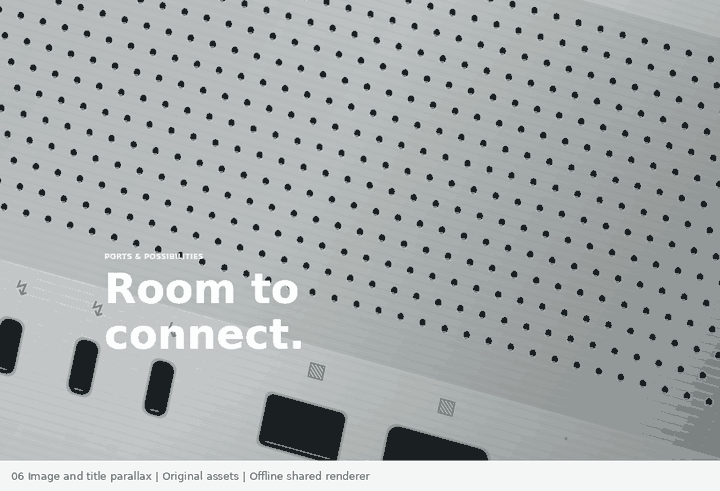

# 06 · Image scale & title parallax

A standalone, dependency-free Canvas 2D study of one product image and independently moving typography. Open `index.html` from the collection or as a standalone local file.

## What is reproduced

- One unchanged original back-panel illustration scales from **1.4 to 1**
- A separate headline track travels **−50vh**, with an ease-in-out curve
- Following copy fades across **25vh** of a 250vh track (a normalized interval of 25 / 150, because the sticky viewport consumes 100vh)
- The image exits, leaving complete readable copy
- Scroll reversal, keyboard-accessible seeking, play/pause, repeat, reset, responsive art, and a static reduced-motion fallback

`scene.js` is the same UMD renderer in the browser and Node. Exports: `render(ctx,width,height,progress,options)`, `state(progress)`, and `duration:7`. Runtime: `window.MOTION.setProgress(p)`, `getState()`, `destroy()`, `play()`, and `pause()`.

The optional seven-second playback is a demonstration convenience. The source is scroll-position driven, with no intrinsic seven-second duration.

## Source observations and correspondence

Reference: https://www.apple.com/mac-studio/

The source's `ConnectivityReveal` controls a **single image**, not a frame sequence. It scales 1.4→1, moves the headline upward by 50vh, and fades content over 25vh. The inspected source module is in the public https://www.apple.com/v/mac-studio/o/built/scripts/main.built.js file. The supplied actual-page recording begins while the preceding section is still partly visible. This standalone study intentionally begins with its own image.

Suggested phase-matched raw capture anchors:

`[[0,0],[10,.25],[20,.55],[27,.72],[31,.86],[41,1]]`

The 42 captured raw frames become 41 decoded GIF frames because one consecutive image is identical. Use original raw frame indices for `phase-map.json`, not decoded indices. The source recording scrolls from approximately Y18454 to Y19920; no source page coordinates are hardcoded into the example. The source's measured 1.217→1.081→1 scales describe a sampled subset of its full 1.4→1 range. Phase correspondence is not a claim of exact source-pixel or source-timestamp equivalence.

## Verification

`node test.cjs` passed all six focused tests; results are in `qa.json`. Tests cover finite state/clamping, byte-identical reverse-seek renders, three responsive sizes, image scale/headline/copy endpoints, transport and scroll controls in a DOM harness, and reduced motion in the harness. Desktop and phone-ratio pixels were inspected and a mobile copy-heading overflow was fixed.

Real-browser sticky layout, operating-system reduced-motion, and physical-device interactions were not run.

## Artwork provenance

All geometry, port cutouts, vent holes, metal gradients, and machining lines are original procedural code. The back-panel geometry is stable at all progress values; only its overall transform changes. No Apple assets, logos, product frames, external media, or font files are included. This is a mechanism-focused recreation using visibly different neutral hardware.

## Runtime resize correction (v0.1.2)

Resizing now recalculates progress from the new track/viewport geometry while in scroll mode. Manual seek and playback retain their positions. The [collection regression harness](../../integration-tests/mac-studio/test-runtime-regressions.cjs) covers all three cases with changed viewport and track heights. Scene rendering, phase mapping and original artwork are unchanged by the runtime correction. This adds DOM-harness coverage; real-browser resize/sticky validation is still outstanding.

## Standalone Motionbook package

Version 0.1.2. This directory is independently runnable: open `index.html`, or run `npm start` and visit `http://localhost:8000`. Browser runtime requires no package installation. For offline tests, run `npm install` then `npm test` in this directory. Node.js and the pinned test-only Canvas package are required.

The normal-speed preview is an offline export of the shared live renderer, not a browser recording. Official reference captures and side-by-side comparison GIFs are deliberately excluded. See [provenance](PROVENANCE.md) and [validation boundaries](VALIDATION.md).

## Compressed web preview

The packaged GIF is a 720×491 web preview with 120 frames over 8.05 seconds. Every original frame delay and the infinite-loop setting are preserved. Its downscaling and 24-color palette reduction change pixels; it is not a lossless or pixel-identical replacement. The [compression record](../../integration-tests/mac-studio/qa/parallax-web-preview-compression.json) keeps original and packaged hashes, dimensions and timing evidence. The original high-resolution GIF is retained separately, without a duplicate in this package. Animation timing, scene code and renderer-regression hashes remain unchanged.
