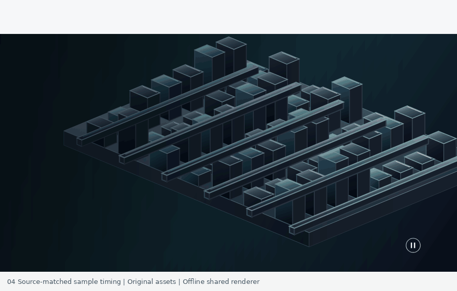

# 04 · Video and scroll copy

Open `index.html`. Scroll moves the text while an original six-second MP4 loops independently. The pause button only pauses media. The range control seeks text without seeking video. The six claims are illustrative creative copy, not hardware benchmarks.

## Mechanism

The inspected Mac Studio page uses a muted, playsinline, looping video with separate scroll-opacity and text-translation keyframes. This study follows that split: `original-loop.mp4` is a real generated 24 fps loop; `motion.js` drives scroll copy and media control separately. Media pauses and resets outside the section and pauses in hidden tabs. Reduced motion pauses the media; all six claims remain accessible in ordinary HTML below the scene.

Canvas fallback animation requests frames only while the section is visible, the tab is visible, playback is unpaused, reduced motion is off, and the video has no decoded frame or has failed. A ready video uses no Canvas animation loop. Paused, offscreen, hidden-tab and reduced-motion states repaint only in response to events. Media readiness/error events recheck the fallback; resuming starts a fresh frame-time baseline without adding the time spent idle. Cancelled callbacks cannot restart a stopped or destroyed loop.

The original artwork is a procedural teal architectural circuit landscape. It does not reuse Apple's machinery video. `scene.js` draws the same background and overlay used for deterministic offline output, with `options.time` / `options.mediaTime` independent of progress. The browser uses the rendered MP4 for the background and Canvas for the overlay. Video compression can create slight pixel differences from the offline background renderer.

## API and checks

`window.MOTION` exposes `setProgress`, `getState`, `setPaused`, and `destroy`. `MotionScene` exposes `render`, `renderBackground`, `renderOverlay`, and `state`. Run `node test.cjs` for independent-clock, seek, pause/reset, reduced-motion, visibility, clamping, responsive-render, and teardown checks, plus queued-frame and draw-count assertions, media readiness/error transitions, stale-callback cancellation, and fallback clock resumption. This is offline Canvas/DOM-harness QA, not a real-browser or screen-reader result.

The comparison uses normalized captured scroll travel. The sampled reference does not establish a continuous native animation duration. Preview GIFs are explicitly labeled offline shared-renderer exports.

## 2026-10-07 frame-audit correction (v0.1.1)

The original delivered preview incorrectly used a generic 8.05-second trajectory with long holds and a reverse leg 1.975 times faster than its forward leg. Its first claims appeared too early and its visible travel was roughly half the source. This revision removes that demonstration track from example 04.

The inspected source uses 28px type, 32px lines, five 64px claims plus one 96px claim, 58px gaps, and a 706px list. The list transforms linearly from +733.5px to -733.5px over 1902.5px of scroll at the 761px reference viewport. Source animation-engine damping is disabled for this scroll group. Pre-sticky document motion contributes a separate body offset before the container pins.

`scene.state(p)` now reconstructs those coordinates and six source opacity intervals. The extracted segment covers section-relative q=-140 through 1170 CSS px. Runtime scrolling stays linear in q; it does not hardcode variable speed or ease in/out. `reference-playback.json` stores the actual 45 reference sample positions and original GIF delays, totaling 4.52 seconds including the reference's deliberate endpoint padding. Positions for transparent opening frames 0–5 are inferred from the visible section boundary; frames 6–44 are measured from text markers. The GIF track preserves double-step/duplicate samples and does not claim a constant native playback speed. Media time still advances independently of text progress.

Frame-by-frame raster verification of the 39 measured states found marker-top mean absolute difference about 0.05 raw pixels, maximum about 0.09 pixels. This is approximate edge-measurement precision, not whole-image similarity or guaranteed subpixel ground truth. Typography, copy and background artwork remain original. The corrected GIF is an offline shared-code render, not a browser recording.

## Standalone Motionbook package

Version 0.1.2. This directory is independently runnable: open `index.html`, or run `npm start` and visit `http://localhost:8000`. Browser runtime requires no package installation. For offline tests, run `npm install` then `npm test` in this directory. Node.js and the pinned test-only Canvas package are required.

The normal-speed preview is an offline export of the shared live renderer, not a browser recording. Official reference captures and side-by-side comparison GIFs are deliberately excluded. See [provenance](PROVENANCE.md) and [validation boundaries](VALIDATION.md).
