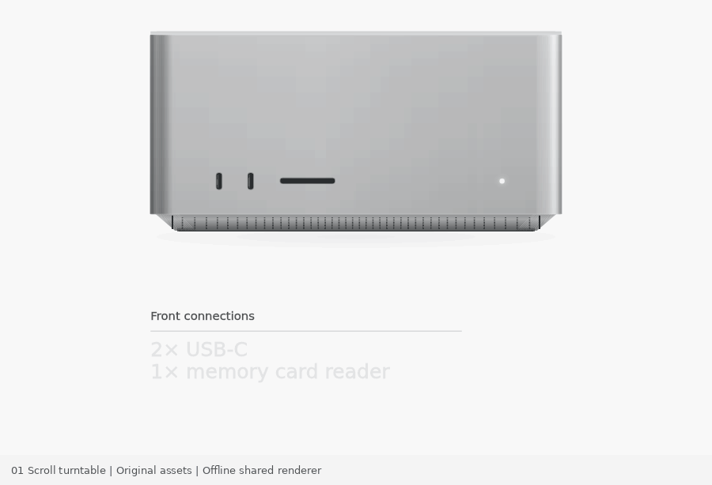

# 01 · Product turntable

A standalone, reversible, scroll-linked connection story. Open `index.html` in a browser. There is no build step and no network dependency.

## Controls and public API

- Scroll through the 320vh section, drag the native range control, or use Play / Pause / Reset.
- `window.MOTION.setProgress(p)` seeks synchronously to a clamped 0–1 progress and pauses playback.
- `window.MOTION.getState()` exposes progress, 0–89 frame index, orientation, caption opacities, mode, and reduced-motion state.
- `window.MOTION.destroy()` removes scroll/resize/input/media listeners and stops playback.
- `window.MotionScene.render(ctx, width, height, progress, options)` is the exact render function used live and by offline exports. In Node: `require('./scene.js')`.

## Source mechanism and reconstruction

Reference: https://www.apple.com/mac-studio/ , public `ConnectivitySequence` module in https://www.apple.com/v/mac-studio/o/built/scripts/main.built.js and layout in https://www.apple.com/v/mac-studio/o/built/styles/overview.built.css . Inspected 2026-10-07 along with the supplied live-page capture.

The source uses 90 prerendered JPEG frames drawn to a 2D canvas, with progressive loading and a nearest-loaded-frame fallback. This reconstruction uses an ORIGINAL procedural Canvas 2D model, quantized to 90 orientations. It does not bundle Apple frames, photographs, logos, proprietary renders, or page code. Its deterministic drawing has no image network fetch and therefore no frame-loading fallback. This is a mechanism study with different artwork, not an identical media pipeline or pixel-perfect product replica.

Progress is normalized across the 220vh sticky travel inside the 320vh section:

| Part | Source vh offset from section top | Normalized progress |
|---|---:|---:|
| Front heading / rule entry | −50 → 16 | −.2273 → .0727 |
| Front list entry | −10 → 39 | −.0455 → .1773 |
| 90-frame half turn | 50 → 195 | .2273 → .8864 |
| Front heading exit | 156 → 160 | .7091 → .7273 |
| Front list exit | 153 → 160 | .6955 → .7273 |
| Back heading entry | 160 → 176 | .7273 → .8 |
| Back lists entry | 160 → 195 | .7273 → .8864 |

The integer values preserve the source `ceil(320 × proportion)` calculations. The first front view holds, the diagonal footprint grows naturally, the left side enters while the front moves to the right, and the rear descriptions take over late in the turn. Reverse seek is stateless and pixel-identical.

## Access and fallback

Native buttons and a labeled native range input are keyboard accessible. A separate screen-reader description contains the connection text. Under `prefers-reduced-motion`, scroll scrubbing and autoplay stop; the page becomes a still-state study, with Next view and manual range inspection. The neutral enclosure and connector descriptions are illustrative.

## Verification

`node test.cjs` requires the available test-only `@napi-rs/canvas` package. The delivered browser code itself has no dependencies.

Passed: JS parsing; reverse progress pixel hashes; 390×620, 900×560, 1440×800 renders; VM DOM-mock tests for deterministic seek, slider, reset, playback completion, reverse scroll, reduced-motion no-autoplay behavior, and cleanup.

Live-browser interaction QA was not run. Exported frames/GIFs are offline renders of the shared live scene function and must not be described as browser recordings. Canvas font rasterization may differ between platforms.

## Measured frame comparison

At 900×560 reconstruction output against the 900×558 supplied source GIF, the front and final rear product silhouette measures approximately x189–710 / y31–284 versus source x190–710 / y31–285. This geometry alignment does not imply matching internal details, surface rendering, or exact sampled progress. Five source-frame-fraction comparisons are recorded in `geometry-review.json`; equal frame fraction is not assumed to be equal source scroll progress.

## Standalone Motionbook package

Version 0.1.2. This directory is independently runnable: open `index.html`, or run `npm start` and visit `http://localhost:8000`. Browser runtime requires no package installation. For offline tests, run `npm install` then `npm test` in this directory. Node.js and the pinned test-only Canvas package are required.

The normal-speed preview is an offline export of the shared live renderer, not a browser recording. Official reference captures and side-by-side comparison GIFs are deliberately excluded. See [provenance](PROVENANCE.md) and [validation boundaries](VALIDATION.md).
