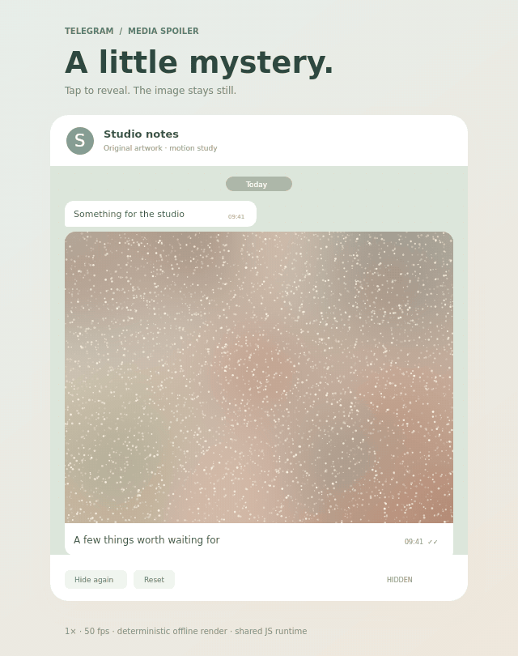

# Telegram Media Spoiler / 隐藏媒体

An independent, interactive web recreation of Telegram’s December 2022 media-spoiler reveal. Original artwork sits under a blurred image and drifting particles; a soft mask expands from the actual tap location.

这是对 Telegram 2022 年 12 月「隐藏媒体」动效的独立 Web 复现：原创新绘底图、细小闪烁粒子，以及从点击位置向外扩散的柔边揭开。公开包不包含官方视频、源画面或对照截图。



## Open and use

- Open [standalone.html](standalone.html) directly. It embeds all JavaScript, CSS and artwork; no account, network, build or server is needed
- Or serve this directory with `npm start`, then open the printed local address in a browser. [index.html](index.html) loads the adjacent source and assets
- Click the concealed media to reveal from that point; Enter/Space on the focused button reveals from the centre
- `Hide again` reverses the mask; `Reset` immediately conceals it
- Repeated clicks do not restart or move a running reveal. A reveal can interrupt a hide without jumping its origin or radius
- Reduced motion makes reveal/hide immediate and freezes decorative particles. Revealed idle media and background tabs stop scheduling frames

Hide, reverse and reset are study controls. The official reference demonstrates a one-way reveal; these additions are not claims about native Telegram behavior.

## Reference and provenance

- [Official article: Hidden Media, December 30, 2022](https://telegram.org/blog/hidden-media-zero-storage-profile-pics#hidden-media)
- [Official embedded video](https://telegram.org/file/464001154/11e69/9FLiJnH4fF4.2869553.mp4/18ca1dba8837d3db6f), linked for attribution and external reference only
- [Source observations and methods](evidence/source-measurements.md), [numeric measurements](evidence/source-measurements.json), and [public-release provenance](evidence/public-release.json)

The retained source analysis describes a 1080×1080, 60 fps, 9.5-second promotional video. The stationary second reveal was used for calibration. Its onset lies between PTS 7.533 and 7.550 seconds; the runtime uses a 180 ms state envelope. Fitted 50%-clear radii are approximately 110, 150, 195, 240, 282 and 316 source pixels, with approximately ±10–20 px fitting uncertainty. The inferred edge is broad, roughly 100–125 source pixels from 10% to 90% clear. The large tutorial touch marker is deliberately omitted.

These are historical observations of a 2022 promotional video, not measurements of current Telegram clients or proof of exact native easing. The first reveal in that video appears longer than the stationary second reveal. Source and timing-audit numerical records are carried forward, not remeasured during public-release preparation.

The interactive runtime, original artwork, standalone page and normal 50 fps preview are byte-identical to the approved example. This bundle excludes official source video and imagery, source-pixel comparisons/crops, the superseded version-0 GIF, frame caches and private-path logs. No source-containing comparison animation or timing-master video is included. Telegram and the original source media belong to their respective rights holders; this study is independent and unaffiliated.

## Implementation

[src/motion.js](src/motion.js) is shared by the interactive page, tests and deterministic offline renderer. The state machine retains the actual tap origin. A piecewise radius curve and explicitly integrated Gaussian-blurred disk produce the initial translucent centre and broad soft edge without a visible ring. The clear artwork stays stationary. The same mask removes blur and particles together.

The seeded particle field uses persistent drift paths and short opacity lifetimes, not independent random noise every frame. Exact native particle trajectories and shader parameters cannot be identified from the promotional video. This is a source-grounded approximation, not a pixel-perfect recreation.

[Rendered mask measurements](evidence/render-mask-measurements.json) record approximately 109, 149, 197, 239 and 282 px at the first five useful 50%-clear boundaries, near the fitted source values. This is calibration against the same observations, not an independent accuracy test.

## Preview timing

The normal preview is 640×810, with 180 frames at uniform 20 ms delays: 50 fps and exactly 3.6 seconds. It is a deterministic offline render, not a browser recording. The reveal trigger is 1311.666667 ms, so the first visible sample arrives +8.333 ms later and preserves the weak initial centre-opacity ramp. The first three isolated rendered centre values are approximately 13%, 66% and 98% clear.

The older 30 fps export omitted that subtle first stage despite preserving total duration. Only export sampling was corrected; the 180 ms runtime envelope is unchanged. Reset is separate preview choreography at the first sample after 3050 ms, not native Telegram behavior.

- [Render manifest](evidence/render-manifest.json)
- [Corrected-export numeric audit](evidence/timing-audit/correction-validation.json)
- [Historical version-0 model audit](evidence/timing-audit/model-audit.md)
- [Historical source timing audit](evidence/timing-audit/source-timing-audit.md)

## Validation and limits

The public release has 64 passing Node checks, including model/state behavior, interruptions, responsive coordinates, reduced motion, deterministic particles, actual offline rendering at three sizes, preview timing, public-file exclusions, preserved-file hashes, local documentation links and standalone asset embedding. See [test output](evidence/test-output.txt) and [public validation](evidence/public-validation.json).

All 180 GIF frames and all six included PNGs were fully decoded for this release. FFmpeg also decoded the GIF to completion. The normal GIF SHA-256 is `62b93b420e5e39c4dc25f82cfdee28f3a1381050cca644d39a85bce6fad53bba`.

Event-wiring tests use a minimal DOM double, not a browser. Browser layout, real pointer/touch execution, accessibility-tree behavior, performance and real-device refresh scheduling have not been verified. Historical source-measurement claims are distinct from the checks rerun for this public release. [FILES.sha256](FILES.sha256) covers every included file except the checksum file itself.

## Reproduce locally

Runtime dependencies: none. Node is needed only for tests/render/build. Development dependency: `@napi-rs/canvas` 0.1.100. Rendering also needs FFmpeg and uses DejaVu Sans when available; interactive typography uses the browser’s system fonts.

```sh
npm install
npm test
npm run render
npm run build
```

The supplied preview is retained exactly; rerendered output may differ with fonts, encoder or platform versions. [tools/make-art.cjs](tools/make-art.cjs) creates the original artwork. [tools/make-blur.py](tools/make-blur.py) requires Pillow and produces its Gaussian-blurred asset. `node tools/measure-render.cjs` reproduces isolated mask measurements without reference media.

Optional source-analysis tooling is retained, but its external inputs and source-containing outputs are excluded. `node tools/compare.cjs SOURCE_MP4` accepts an authorized local source video. `python3 tools/timing-audit.py SOURCE_MP4 VERSION_0_GIF` additionally requires an externally retained old export. Neither is required to run, test, render or build the public demo. Do not add their source-containing outputs to the public bundle; regenerate checksum and validation records after intentional release edits.
