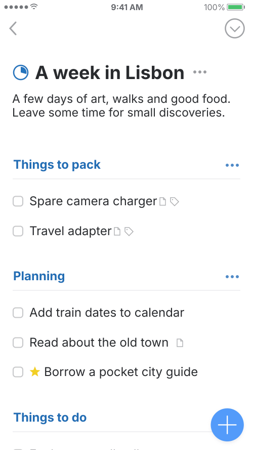

# Things · Magic Plus

[Demo](index.html) · [MP4](preview/loop.mp4) · [Validation](VALIDATION.md) · [Source & attribution](PROVENANCE.md)

Lift the blue plus, pass through the list’s insertion slots, release it into a new task, then close the editor back into its place in the list.

基于 Cultured Code 2017 年 Things 3 官方演示逐帧量测，独立重建“按下收缩 → 放大提起 → 拖动让位 → 松手展开编辑器 → 收起保留新任务”的完整第一轮。文字与图标独立绘制；不是原生 Things 录屏，也不是其源码。

## Run

Open `index.html` directly, or run `npm start` and open the printed localhost URL. The browser runtime has no external dependency, account, network call, or build step.

- `npm test`: 62 deterministic motion, controller, simulated-DOM adapter, numerical-evidence, export-integrity, and complete normal-media decode checks
- `npm run render -- --source /absolute/path/to/6-magicplus-1.mp4`: offline preview through the same scene used by the browser
- `npm run compare -- --source /absolute/path/to/6-magicplus-1.mp4`: optional local source/reconstruction review at identical PTS; requires your own lawfully obtained source and is not part of the public bundle

Tests and offline export require Node 20+, Sharp (`npm install`), and system ffmpeg/ffprobe. The demo itself needs none of those export dependencies. Tests use the bundled numerical evidence and independently authored normal previews; they do not download or require official footage. The official video, source frames, reference-pixel comparisons, comparison poster/contact sheet, and comparison-only manifest are excluded. The optional comparison command produces ignored local review files; remove those files before running the public-bundle tests or publishing.

For a source-free render from the retained timeline, use `npm run render -- --out /absolute/path/to/local-preview`. This writes an independent preview without claiming to re-verify the original video. Preserve the bundled source-verified export when running the public-bundle checks.

## Controls

Play/pause, replay, single-source-frame scrubbing, optional repeat, and “Try it yourself”. In manual mode, drag the plus to the marked gap below “Travel adapter”, release, type a task, and press Enter or Save. Escape cancels. When the stage has focus, Enter opens an editor; arrow keys step the reference timeline and Space pauses.

Manual editing is an intentionally bounded demonstration, not a complete task manager. One inserted task is shown per cycle; Reset starts fresh. The keyboard drawing is illustrative; the actual text input accepts the system keyboard. The inbox and cancel circles reproduce visible drag affordances but are not additional implemented drop targets.

Reduced motion stops autoplay and settles manual transitions immediately. Hidden-page and back/forward-cache events freeze the timeline. Returning never consumes time spent hidden.

## Evidence boundary

The source is 500 × 888 at 30 fps, with a 1/30000 time base. The normal preview uses 225 original frame timestamps for the half-open interval [0, 7.5) seconds, without speed alteration. GIF can only store centisecond durations; its timing error is recorded separately.

The position/radius/slot/scroll observations come from the source. Video pixels do not reveal native spring constants, touch thresholds, code, or interruption semantics. Manual controls, cancellation, repeated input, and reduced-motion behavior are supplemental design choices. Tests of those choices are not evidence about native Things.

The preview is deterministic Sharp/librsvg rasterization of `scene.render(motion.referenceAt(t))`; browser layout, accessibility-tree behavior, touch hardware, and GPU rendering have not been verified. See `VALIDATION.md` for the exact test results and limits.
