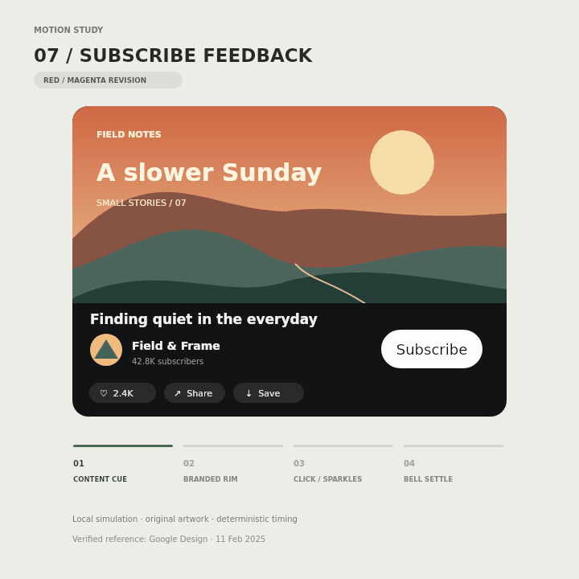

# YouTube subscribe feedback

[Run](index.html) · [中文说明](README.zh-CN.md) · [Provenance](reference/ATTRIBUTION.md) · [Validation](VALIDATION.md)

An independent study of the red–magenta subscribe feedback in Google Design’s [2025-02-11 component demonstration](https://design.google/library/youtube-new-red-color). The reference is versioned; it is not verified as identical across every current YouTube platform or account.

From this directory, run `npm start` (Node 20+) and open http://127.0.0.1:4177. Runtime has no external dependencies. Controls cover replay, reset, simulated content cue, early activation and reduced motion. All subscriptions are local simulated state.

Run `npm test` for 21 model and simulated-DOM tests. Optional `npm run render` requires the pinned development dependency @napi-rs/canvas and FFmpeg; `python3 validate.py` requires Pillow. The public renderer reproduces only the original-artwork preview, with no official media. Actual browser, touch, focus traversal, accessibility-tree and cross-browser rasterization QA remain unrun.

The content cue and activation reward are separate tracks in the official component showcase. The example joins them into an explicitly simulated sequence. Timing and geometry are measured approximations, not native YouTube constants or source code.

## Interaction revision 2.0.1

Escape resets even while a native control has focus and does not intercept IME composition. Completed demo/cue/reward sequences stop animation work; reduced motion retains automatic cue and simulated activation through one cancellable timer. Visibility and persisted page restoration cancel stale scheduling. The normal 162-frame offline sequence is unchanged, and the original GIF is retained; see VALIDATION.md.
