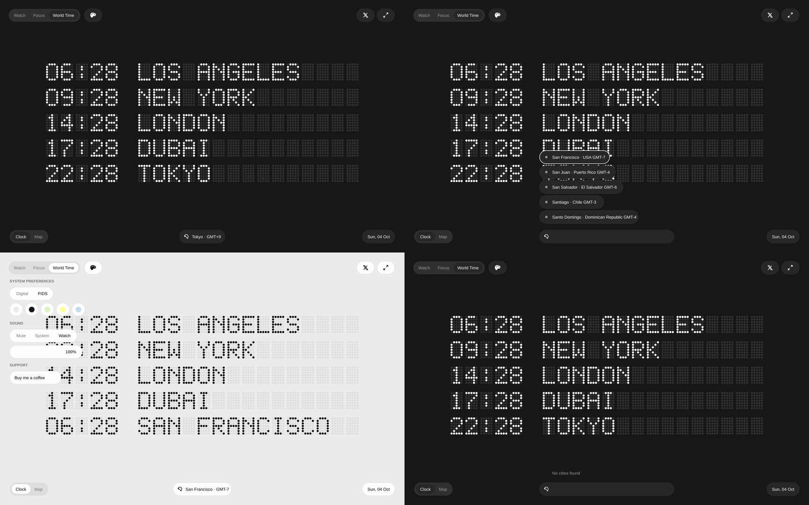

# Airport matrix time · source-only WIP

[Open source](index.html) · [Run and validation](VALIDATION.md) · [Reference](SOURCE.md) · [Rights](RIGHTS.md) · [Recovery status](STATUS.md)

The recoverable clock board now includes keyboard/pointer city search, accessible hit targets, reversible light/dark transitions, reduced motion and idle render shutdown. 18 Node tests pass.

Original footage is currently unavailable (HTTP 403), so exact motion completion and all-native-frame comparison remain blocked. This WIP is not an accepted showcase entry. The watch/splash sequence and several pictured controls are unfinished.

Run `node --test test.cjs app.test.cjs`. The browser entry point has no dependency or build step. The optional offline snapshot script uses `sharp`.
